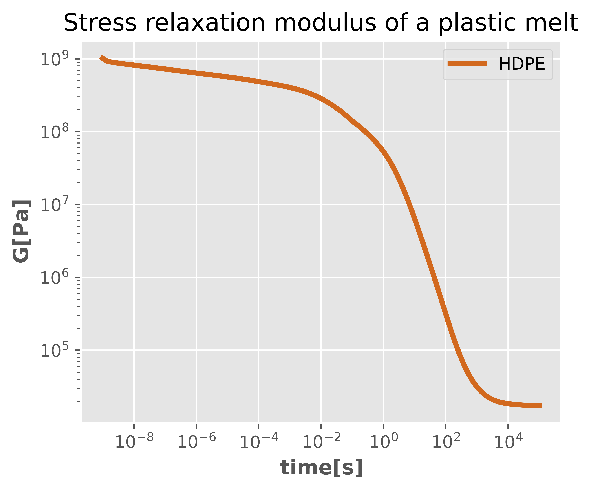

# Relaxation of a plastic melt during processing [Simulation]

https://adamjeedurabuilt.com/wp-content/uploads/2021/08/010-800x313.jpg

## Introduction
---
>Modeling and simulation  are an integral part of engineering. It helps us test ideas and concepts before time and resources are investment in them. Eventhough commercial softwares are available to help with that, presently no software specifically addresses problems in polymer science. In the course of my study, I had to develop all the software that I required for my research. This current one is one of them. My hope is that, this initiative should end up being an open source project with contributions from others in the field.

This programs evaluates the manner in which a chain in a plastic melt relaxes when the imposed stress is removed. During processing of plastics, products of desires size and properties are manufactured so as to meet certain engineering needs. When the plastic melt leaves the extruder, it has the tendency to swell, since the barrel from which it was extruded no longer imposes constrains on it. A clear understanding and evaluation of the relaxation of the melt is therefore a must to produce materials of specific size and shapes. With this program, the relaxation mechanism of a melt can be estimated. This program is an implementation of the theoretical works of [Pattamaprom et al(2000)](https://link.springer.com/article/10.1007/s003970000104), you can find that article in this repository in the folder "reference". For a non detailed explanation of the theory check the article I published [[*kwakye-Nimo et al.(2022)*](https://pubs.acs.org/doi/abs/10.1021/acs.macromol.2c01102)] and for the numerical implementation, read the file "notes_on_numerical_implementation.md" in this repository.

## Dataset
---
>The dataset was digitized from a paper published by [*kwakye-Nimo et al.(2022)*](https://pubs.acs.org/doi/abs/10.1021/acs.macromol.2c01102) [Figure 1]. It represent the molecular weight distribution of an HDPE material.

### Project structure

* the folder _reports_ contains, the executive summary
* all codes can be found in the folder _src_
* the file _notes_on_numerical_implementations.md_ gives details on all the numerical steps that were taken to develop this program

## Key insights
---
>Partial differential equations (PDE) are used not only in engineering but almost all fields. Whenever a feature of interest depends on two or more independent variable, then PDE will certainly show up when modelling the system. In Finance for example, it is often used for option pricing. In this context however it was used to model the relaxation of a plastic melt. From the Figure below, we can evaluate the stress stored in the material at a given time. For example around 100s we have about $2 \times 10^5Pa$ of stress to contain.

In this work, the finite difference method was employed to find solutions to the problem of the diffusion of a chain in a plastic melt and the evaluated stress relaxation modulus is presented below.

The program incorporated the following:
* the reptation of the chain along it's axis
* the fluctuations along its contour length 
* A check to ensure that relaxation is not faster than the rouse relaxation time
* a consideration of having both the chain and its surrounding in motion at the same time.

## How to use this program
* First install the required dependencies using the requirement.txt file.
* the codes are hosted in the _src_ folder. It contains: _material_function.py_, _chain_in_a_fix_matrix.py_ and _chain_in_a_variable_matrix.py_, which are 3 class objects files with codes for evaluating the material parameter, solving the diffusion for cases where only the chain is allowed to move and solving the diffusion equation for case where both the chain and its surrounding can move. The only file that needs modification is the _workpad.py_, that is where all program inputs are supplied. The inputs are:
    * the molecular weight distribution of the plastic material in question.
    * the time steps over which the evolution of the diffusion of the chain is observed.
    * the number of nodes along the chain where the solution to the PDE should be sought.
    * the monomer weight, entanglement weight and equilibrium time are all material constants that also need to be supplied.

## Ways to improve the program
There are several works planned for the future:

1. **Multi-processing:** parallel computing can be used to make the program run faster. This program currently makes use of a loop to find solutions for all the chains. This task can be distributed to the number of cores available to the processor.
2. **Conversion to other material functions:** Currently, this program outputs the stress relaxation modulus. But polymer scientist traditionally prefer to work with the storage and loss modulus since measuring the stress relaxation modulus is experimentally challenging due to torque sensitivity. What can be done to improve this program in the future is to use mathematical relation to convert the stress relaxation modulus to other material functions.
3. **Graphical interface:** Then finally a graphical user interface can be added.
## Tools used in this project
---
* Packages: Anaconda
* Libraries: Pandas, Numpy, Scipy, Matplotlib
* Programming languages: Python 3
* Numerical analysis