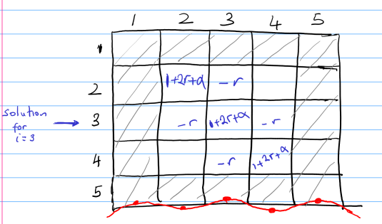

# Numerical implementation of Crank–Nicolson method.

The motion of a chain in a plastic melt can be described by the diffusion equation with some modification. 

The partial differential equation we will be solving is:

$\frac{\delta P(s,t)}{\delta s}=\frac{1}{\pi^2 \tau_d}\frac{\delta ^2 P(s,t)}{\delta s^2} - \frac{1}{\tau_s}P(s,t)$

where $P$ describes the probability that a chain can escape its surrounding and relax its imposed stresses and $\tau_s$ is the fluctuation along the contour length of the chain. For detailed theoretical explanations on the diffusion of a chain in a melt consult the original works of [Pattamaprom et al(2000)](https://link.springer.com/article/10.1007/s003970000104) on which this simulation is based or read the section i wrote under molecular modeling in the article I published [here](https://pubs.acs.org/doi/abs/10.1021/acs.macromol.2c01102).

Crank–Nicolson method would be used to solve this partial differential equation which has the advantage of being unconditionally stable. 

The numerical definitions of the derivatives presented below are from this souce [ Wikipedia](https://en.wikipedia.org/wiki/Crank%E2%80%93Nicolson_method):

$\frac{\delta P}{\delta t} = \frac{P_i^{j+1} -P_i^j}{\Delta t}$

$\frac{\delta^2 P}{\delta s^2} = \frac{1}{2 (\Delta s)^2}\left[ (P_{i-1}^{j+1} -2P_i^{j+1} + P_{i-1}^{j+1}) + (P_{i-1}^{j} -2P_i^{j} + P_{i-1}^{j})\right]$

and 

$P = \frac{1}{2}\left[P_i^{j+1} +P_i^{j} \right]$

Substituting these definitions into our diffusion equation gives us:

$\frac{P_i^{j+1} -P_i^j}{\Delta t} = \frac{1}{\pi^2 \tau_d} \left[\frac{1}{2 (\Delta s)^2}\left[ (P_{i-1}^{j+1} -2P_i^{j+1} + P_{i-1}^{j+1}) + (P_{i-1}^{j} -2P_i^{j} + P_{i-1}^{j})\right]\right] - \frac{1}{2\tau_s}(P_i^{j+1} +P_i^{j})   $

The solution to the diffusion equation is sought at different point along the chain called nodes and referred to by the $i$ subscript. Since this diffusion is observed over time, the superscript $j$ keeps track of the time steps. The disadvantage of the Crank-Nicolson method is that for every time step we need to setup the matrix and solve it.

Let's simplify the expression by letting 

$r = \frac{\Delta t}{\pi^2 \tau_d \cdot 2 (\Delta s)^2}$

 and 

 $\alpha =  \frac{\Delta t}{2 \tau_s}$

 this leads us to:

 $P_i^{j+1} -P_i^j = r[ (P_{i-1}^{j+1} -2P_i^{j+1} + P_{i-1}^{j+1}) + (P_{i-1}^{j} -2P_i^{j} + P_{i-1}^{j})] - \alpha [P_i^{j+1} +P_i^{j}]$

 Rearranging by grouping the $j+1$ superscripts which refers to the next time step from tye $j$  gives:

 $-rP_{i-1}^{j+1} + (1 +2r + \alpha)P_{i}^{j+1}-rP_{i+1}^{j+1} = rP_{i-1}^{j} + (1 - 2r - \alpha)P_{i}^{j}-rP_{i+1}^{j}$

 This makes it evident that we are dealing with a matrix of the form
 $AP^{j+1} = BP^{j}$

 Let us now  build the $A$ matrix with just a chain having 5 nodes as an example. Since the boundary conditions gives the solutions at the end of the nodes, it means that we now have to solve only for the internal nodes [ie 5-2=3], given us a matrix of size $3 \times 3$ to handle. So the boundaries have been greyed out as shown in the figure below [ the red line is our chain].

 

For illustration we will only build the matrix for the right side i.e. $AP^{j+1}$ which is given by $-rP_{i-1}^{j+1} + (1 +2r + \alpha)P_{i}^{j+1}-rP_{i+1}^{j+1}$

when $i=3$ we will have $-rP_{3-1}^{j+1} + (1 +2r + \alpha)P_{3}^{j+1}-rP_{3+1}^{j+1}$ which leads to $-rP_{2}^{j+1} + (1 +2r + \alpha)P_{3}^{j+1}-rP_{4}^{j+1}$

so the solution to $i=3$ which is $(1 +2r + \alpha)$ will be put in cell (3,3) and that of $P_{2}$ will go to the left and $P_{3}$ to the right of the cell (3,3). By so doing we can build the entire matrix. When we get to $P_{1}$ and $P_{5}$, the solutions are given by the boundary conditions which since known are excluded from this calculation.

In a similar way the $B$ matrix is set and then solution to  $AP^{j+1} = BP^{j}$ is sought.